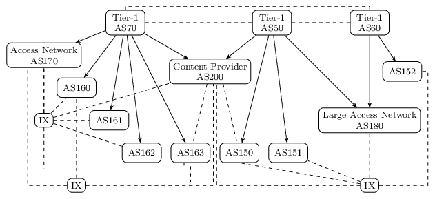
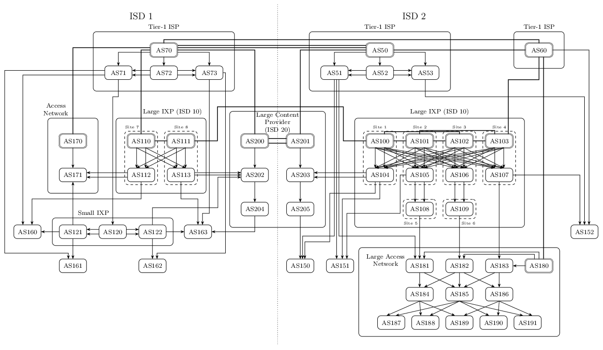

SCION Internet Topology
=======================
Two topology examples showing a possible transition from a BGP-based to a
SCION-based Internet.

BGP Topology
------------
A "flattened" Internet topology with Tier-1 ISPs providing transit and three
IXes providing shortcuts between the other ASes including access networks and a
large content provider.



Lines with arrow heads indicate paid transit connections, dashed lines are used
for settlement-free peering. The three IXes are not ASes themselves, the are
transparent on the network layer. All IX participants are connected to a route
server in each IX enabling full multilateral peering.

### Running the Topology

```bash
./bgp-internet.py
cd bgp
docker-compose build
docker-compose up -d
```

SCION Topology
--------------
A relatively large pure SCION Internet topology created by promoting IXPs in the
BGP topology to ASes and exposing the internal structure of BGP ASes by
splitting them into many SCION ASes. The topology is roughly divided
in two large Internet regions that are represented by ISD 1 and ISD 2.
Additional ISDs exist for large multi-region ASes that can be expected to run
their own ISD. All ASes contain a single internal network and a single control
service and border router. The following graph gives an overview of the AS-level
topology:



SCION core ASes have double outlines, the other ASes are non-core ASes. Thick
lines represent core links, links with arrow heads are transit links. There are
no peering links. The topology consists of Tier-1 ASes, IXPs, a large content
provider and access networks of different sizes.

### Running the Topology

```bash
./scion-internet.py
cd scion
docker-compose build
docker compose up -d # use docker compose v2 (no hyphen)
```

### Implementation Notes

- Everything is in ISD 1 until AS multi-homing is implemented.
- IX networks are used for internal links within IXPs and large ASes that
  consists of many SCION ASes to limit the number of Docker networks that have
  to be created.
- Cross-connections are mainly used for core and transit links between the large
  ASes.

### How does a SCION Internet look like?

- SCION path awareness works best if there are many ASes. Large ASes should be
  split into many (100+) SCION ASes.
- SCION core-beaconing is based on flooding and has limited scalability.
  Therefore, a SCION Internet should have as few core ASes as possible.
- Backup links should be exposed as parallel SCION links. In SCION there are no
  unused backup links, everything is available.
- SCION peering links are of limited use as SCION paths can contain at most one
  peering link. If peering links are used to emulate multi-ISD ASes by creating
  copies of the base AS in multiple ISDs and connecting them in a full-mesh
  peering topology, they cannot be used elsewhere on the path.

#### IXPs
IXPs can expose their internal structure by turning every logical router node
into an independent AS. Large IXPs like as100-113 could benefit from managing
their own ISD with their own set of core ASes. Any AS peering at the IXP would
also join the IXP's ISD. Smaller IXPs with PoPs in only one region can just
join that regions ISD (e.g., as120-122).

In SCION, IXPs need a transit provider to be connected to the (rest of) the
core. These links only exist for control plane and management traffic and should
not be visible or usable by IXP member/customer ASes.

#### Tier-1 ASes
Tier-1 ASes should always contain SCION core ASes. They can expose internal
long distance connections by running different SCION ASes in different
geographical regions. Links and backup links to other Tier-1 providers should
all be exposed as separate SCION links.

#### Large Content Providers
Large content provider with their own internal backbone should run their own ISD
and expose long distance connections as SCION links. Path policies must be in
place so that the internal backbone cannot be abused as transit. Content
provides can reach their customers by peering at IXPs or by peering directly
with last-mile access providers.

#### Access Networks
Smaller access networks could be represented by just a single SCION AS
(as150-152, as160-as163).
The larger the provider network to more SCION ASes should be exposed to allow
customers to select between different routes. For example, as180-191 exposes
different ASes for different connection regions (as187-191) and allows customers
to benefit from redundant connections to aggregation and spine routers
(as181-186) which in turn connect to transit providers and IXPs. Note that the
ISP only needs a single core AS to participate in the ISD core. Additional core
ASes are unnecessary and would only reduce routing efficiency.

### TODO
- Path policies
- Hosts
