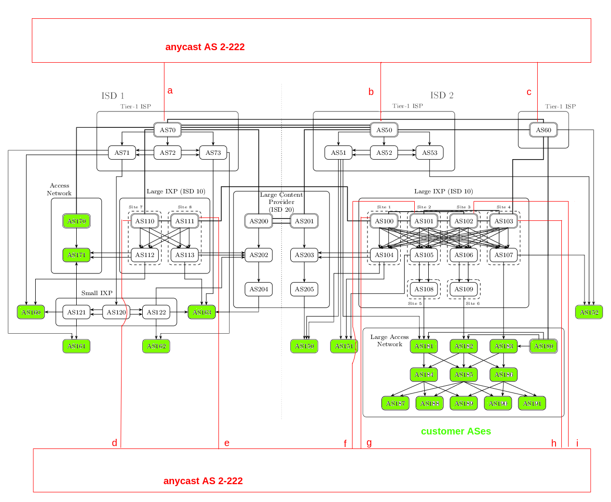

A modified version of S05_scion_internet with an additional Anycast AS.

All ASes within the Anycast ISD are core AS and advertise their presence through core beacons,
to customers in other ISDs.
Anycast ASes have a special beacon policy to not propagate any core beacons,
to prevent transit through the Anycast ISD.
